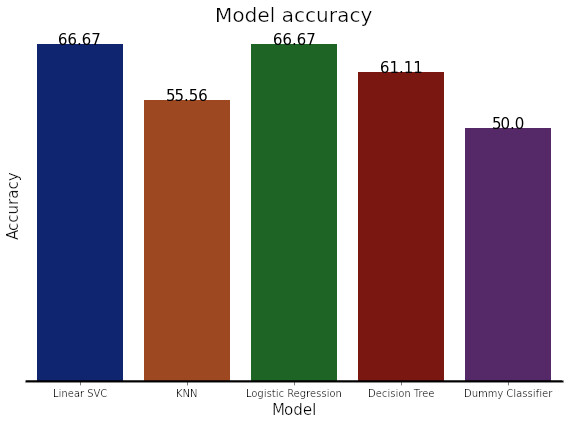

# Professional League of Legends matches prediction with Data Science and Machine Learning
A data science and machine learning project to analyze data from professional League of Legends matches and try to predict their outcome only with data from up to a certain point of the match.

The main part of the analytics is in the [notebook](https://github.com/ThalesRod/lol-pro-match-prediction/blob/main/CBLOL_data_analysis.ipynb).

Here's a little longer [documentation](https://github.com/ThalesRod/lol-pro-match-prediction#introduction) of how the project was developed, but if you're in a hurry there's a short [abstract](https://github.com/ThalesRod/lol-pro-match-prediction#abstract) of how it was done.

## ABSTRACT
The project consisted of 3 stages, the first was the collection of data from the wiki and game servers, as well as the cleaning and aggregation of these data. In the second stage, exploratory data analysis was performed, describing and summarizing the data set through statistics and identifying correlations. The third step consisted of training the classifiers with the processed data set and evaluating them. The results are presented in the [RESULTS section of the documentation](https://github.com/ThalesRod/lol-pro-match-prediction#results).

## INTRODUCTION
League of Legends is an online game based on real-time strategies of 5 vs 5 teams. The game, as an e-sport (electronic sport), has a very large competitive scene around the world and it is growing more and more. Due to their level of competitiveness, teams around the world have analysts who are dedicated to understanding and finding new ways to win more matches. Each match itself lasts, on average, 30 to 35 minutes, and is generally divided into 3 stages, early, mid and late game, each being played in a way and with its importance for success in the match.
    
The objective of this project is to go deeper into the beginning of the game, understand its impact and try, based on data from up to a certain point in the match, to predict the final result.

An analysis of the data of the matches of the regular phase of the 2nd split of the CBLOL 2021 (Brazilian League of Legends Championship) was carried out to develop a model that predicts the results of the matches only with data from the first 10 minutes of the game.

## CONTEXT ABOUT THE GAME
Below is a brief context of the game to support the variables used in the analyses.

In League of Legends, the main objective is to destroy the opponent's buildings, but to achieve this, both teams spend time during the match focused on collecting resources such as gold and experience. The main ways to get resource advantage are: Kill enemy champions and destroy enemy buildings, this second, in addition to the gold advantage, gives an indirect and medium/long term advantage which is the map domain. The game also periodically spawns dragons in an area of the map that, despite not granting gold advantage, grant additional effects to the team that slays them. This phase focused on accumulating resources takes place, on average, until the first 20 minutes of the game, and it is crucial to play the other phases of the game well and, consequently, to win.

## METHODOLOGY
The first step towards achieving our goal was data collection. The [game wiki](https://lol.fandom.com/wiki/), has links to the match history of almost all competitive leagues, including the league that will be analyzed in this project, the 2nd split of CBLOL 2021. Riot Games, the company that founded, maintains the game and manages the official leagues, stores match data in JSON format files on its servers that can be accessed through wiki links but does not provide a public and organized API to obtain these data. To work around this problem, I wrote a script in python that scrapes the wiki with [BeautifulSoup](https://www.crummy.com/software/BeautifulSoup/bs4/doc/), gets the team names and downloads the files for each match. These files had a lot of data about the whole game, some necessary, some not so much, so to simplify, I wrote another script in python that extracted some characteristics from the files in JSON format and aggregated them in a single CSV file. This CSV, which was used in further analysis, contained the match ID, total gold, total champion kills, total destroyed buildings, and total slain dragons for each team, as well as which team won.
    
The second step was to do an exploratory analysis and manipulation of the dataset. This step is explored in more detail in [the project's notebook on google colab](https://colab.research.google.com/drive/1OR-70sjtkDm5D96FAWzTFn7w2U949LgQ?usp=sharing), but in summary, statistical analyzes were performed of the variables, visualizations with graphs and observations of correlations, some manipulations were also made, such as aggregating the data of the two teams to analyze the unique values of each game, creating a column with the teams' gold difference values to analyze correlations and also the normalization of the gold variables to aid the conversion of some algorithms used later.
    
The third step was the training of some Machine Learning algorithms. This step is also explored in more detail in [the project's notebook on google colab](https://colab.research.google.com/drive/1OR-70sjtkDm5D96FAWzTFn7w2U949LgQ?usp=sharing), but basically it was done, like described above, the normalization of the variables referring to the total gold of the teams, the division of the dataset into training data and test data into 80% and 20% of the total, respectively. The training dataset served as input for 4 classification algorithms, the Linear classifier with support vectors (LinearSVC), the K-th nearest neighbor (KNeighborsClassifier), the Logistic Regression (LogisticRegression) and a Decision Tree (DecisionTreeClassifier), using the scikit-learn library implementations of these algorithms. The evaluation of these estimators was done using their scoring methods with the test dataset and a confusion matrix, then these results were compared with a most frequent Dummy classifier and shown in a graph.

## RESULTS
In the data analysis, it was observed that the variables of slain dragons and destroyed buildings, for presenting a small variability, had little effect on the estimates. This variability value can be explained taking into account that the measurement time is at 10 minutes of match, at that time, only one dragon is available to be slain and the buildings still have fortifications, which makes it difficult to destroy them. It was also observed that champion kills had a very high correlation (0.77 for team 1 and 0.80 for team 2) with team gold, this is because kills also yield gold for the team.

The results of the estimators' evaluations are shown in the chart below. For reasons of experiment reproducibility, the values were obtained using the value 29 as a random state seed parameter in the dataset division method. From these results, it is possible to observe that all 4 algorithms presented better results than the classifier Dummy.

## CONCLUSIONS AND FUTURE WORK
Using the Linear SVC model it is possible to predict the result of the match at 10 minutes with 66.67% accuracy based on each team's gold values, kills, destroyed buildings and slain dragons.

The accuracy of these classifiers is higher if data from a time later than 10 minutes of game are used, due to some game mechanics, the variables used may be more significant if measured at some point between 14 and 18 minutes of elapsed game . In future works, more variables can also be added to the model based on other characteristics of a match, which may improve its accuracy. These analyzes can also be done in other leagues around the world, observe the results that converge and diverge, and possibly create a more generalized model that can be effective in international championships.
